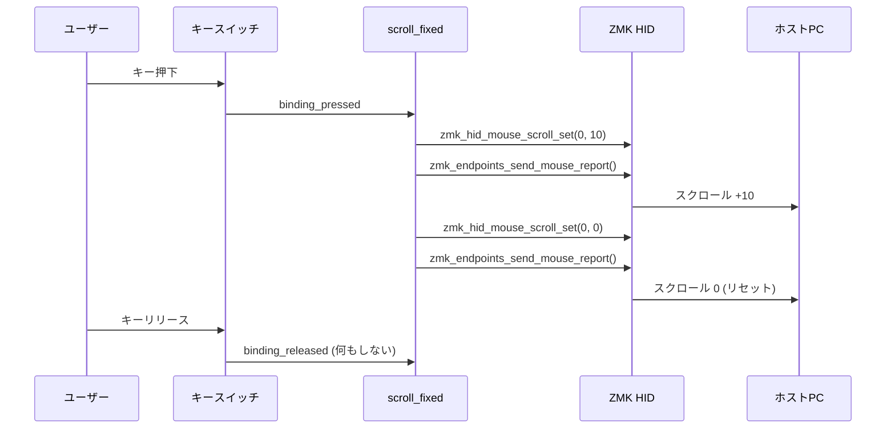

# ワンショット固定量スクロール ビヘイビア - 実装ウォークスルー

## 変更概要

ZMK v0.3 ファームウェアに、キーを1回押すと指定した固定量だけスクロールする「ワンショット」カスタムビヘイビア `zmk,behavior-scroll-fixed` を実装しました。

---

## 変更ファイル一覧

### 新規作成

| ファイル | 説明 |
|---|---|
| [`dts/bindings/behaviors/zmk,behavior-scroll-fixed.yaml`](file:///c:/Users/spica/Desktop/zmk-keyboard-torabo-tsuki-lp/dts/bindings/behaviors/zmk,behavior-scroll-fixed.yaml) | DTS バインディング定義。`scroll-y` / `scroll-x` プロパティを定義 |
| [`src/behavior_scroll_fixed.c`](file:///c:/Users/spica/Desktop/zmk-keyboard-torabo-tsuki-lp/src/behavior_scroll_fixed.c) | カスタムビヘイビアのCドライバ本体 |
| [`docs/fixed_amount_scroll_behavior/`](file:///c:/Users/spica/Desktop/zmk-keyboard-torabo-tsuki-lp/docs/fixed_amount_scroll_behavior/) | 本機能のドキュメント一式 |

### 変更

| ファイル | 変更内容 |
|---|---|
| [`CMakeLists.txt`](file:///c:/Users/spica/Desktop/zmk-keyboard-torabo-tsuki-lp/CMakeLists.txt) | ビルド対象に `src/behavior_scroll_fixed.c` を追加 |
| [`keymap.keymap`](file:///c:/Users/spica/Desktop/zmk-keyboard-torabo-tsuki-lp/config/keymap.keymap) | `scrl_up` (上10) / `scrl_dn` (下10) ビヘイビアインスタンスを定義 |
| [`zephyr/module.yml`](file:///c:/Users/spica/Desktop/zmk-keyboard-torabo-tsuki-lp/zephyr/module.yml) | `dts_root: .` を追加し、カスタムDTSバインディングの検出を有効化 |

---

## トラブルシューティング（GitHub Actions ビルドエラーの修正）

### 原因
スプリットキーボードのペリフェラル側ビルド（`torabo_tsuki_lp_left_peripheral` など）では、ポインティング機能（`CONFIG_ZMK_POINTING`）やキーマップ定義が存在しないため、`behavior_scroll_fixed.c` 内の HID 関数呼び出しがコンパイルエラーとなっていました。
（セントラル側ビルドは正常に成功していました）

### 対策
`src/behavior_scroll_fixed.c` 全体を `#if DT_HAS_COMPAT_STATUS_OKAY(DT_DRV_COMPAT)` で囲み、デバイスツリー上に `zmk,behavior-scroll-fixed` のノードが存在するセントラル側でのみコンパイルされるようガードを追加しました。

---

## 動作の仕組み



---

## 使い方

### 現在定義済みのビヘイビア

キーマップの `behaviors` セクションに以下が追加されています：

```dts
// 上スクロール（10単位）
&scrl_up

// 下スクロール（10単位）
&scrl_dn
```

### キーマップへの割り当て例

任意のレイヤーのキーに割り当てることができます：

```dts
// 例: Layer 6 のキーに割り当て
&scrl_up    // 上スクロール
&scrl_dn    // 下スクロール
```
