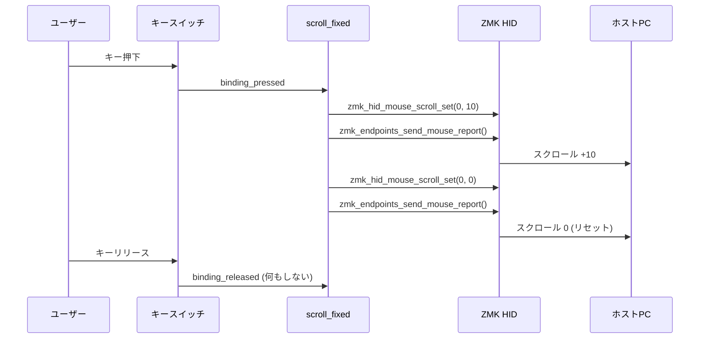

# ワンショット固定量スクロール ビヘイビア - 実装ウォークスルー

## 変更概要

ZMK v0.3 ファームウェアに、キーを1回押すと指定した固定量だけスクロールする「ワンショット」カスタムビヘイビア `zmk,behavior-scroll-fixed` を実装しました。

---

## 変更ファイル一覧

### 新規作成

| ファイル | 説明 |
|---|---|
| [`dts/bindings/behaviors/zmk,behavior-scroll-fixed.yaml`](file:///c:/Users/spica/Desktop/zmk-keyboard-torabo-tsuki-lp/dts/bindings/behaviors/zmk,behavior-scroll-fixed.yaml) | DTS バインディング定義。`scroll-y` / `scroll-x` プロパティを定義 |
| [`src/behavior_scroll_fixed.c`](file:///c:/Users/spica/Desktop/zmk-keyboard-torabo-tsuki-lp/src/behavior_scroll_fixed.c) | カスタムビヘイビアのCドライバ本体 |
| [`docs/fixed_amount_scroll_behavior/`](file:///c:/Users/spica/Desktop/zmk-keyboard-torabo-tsuki-lp/docs/fixed_amount_scroll_behavior/) | 本機能のドキュメント一式 |

### 変更

| ファイル | 変更内容 |
|---|---|
| [`CMakeLists.txt`](file:///c:/Users/spica/Desktop/zmk-keyboard-torabo-tsuki-lp/CMakeLists.txt) | ビルド対象に `src/behavior_scroll_fixed.c` を追加 |
| [`keymap.keymap`](file:///c:/Users/spica/Desktop/zmk-keyboard-torabo-tsuki-lp/config/keymap.keymap) | `scrl_up` (上10) / `scrl_dn` (下10) ビヘイビアインスタンスを定義 |
| [`zephyr/module.yml`](file:///c:/Users/spica/Desktop/zmk-keyboard-torabo-tsuki-lp/zephyr/module.yml) | `dts_root: .` を追加し、カスタムDTSバインディングの検出を有効化 |

---

## トラブルシューティング（GitHub Actions ビルドエラーの修正）

### 原因と対策
1. **未定義関数のエラー (ZMK HID Endpoints の不在)**
   このキーボードはペリフェラル側（左手/右手）にトラックボールを搭載しているため、ペリフェラルビルドでも `CONFIG_ZMK_POINTING` が有効化（TRUE）になります。しかし、USB/BLE を介して PC にマウスレポートを送信する機能（ZMK Endpoints）はセントラル側（母機）にしか存在しません。そのため、当初の `#if IS_ENABLED(CONFIG_ZMK_POINTING)` だけのガードでは、ペリフェラル側でも HID送信関数を呼び出そうとしてしまい、リンクエラー（未定義参照）が発生していました。
   **対策:** `#if` の条件式に `(!IS_ENABLED(CONFIG_ZMK_SPLIT) || IS_ENABLED(CONFIG_ZMK_SPLIT_ROLE_CENTRAL))` を追加し、「スプリットキーボードのセントラル側である場合のみ」実際の HID 送信関数をコンパイル・呼び出すように修正しました。
2. **未使用変数 (Unused Variable) のエラー**
   上記修正やログ出力（`LOG_DBG`）無効化の影響で、ペリフェラル側のビルド時に変数（`event` や `cfg`）が完全に「使われていない」状態となり、Zephyr の `-Werror` によりコンパイルエラーとして扱われていました。
   **対策:** コード内に `(void)event;` などのキャストを明示的に追記し、未使用変数の警告を抑制しました。

---

## 動作の仕組み



---

## 使い方

### 現在定義済みのビヘイビア

キーマップの `behaviors` セクションに以下が追加されています：

```dts
// 上スクロール（10単位）
&scrl_up

// 下スクロール（10単位）
&scrl_dn
```

### キーマップへの割り当て例

任意のレイヤーのキーに割り当てることができます：

```dts
// 例: Layer 6 のキーに割り当て
&scrl_up    // 上スクロール
&scrl_dn    // 下スクロール
```

## �lj����C�F�}�E�X���쒆�̃V���[�g�J�b�g���C���̗D��x�C��

### �w�i
�g���b�N�{�[�����쎞�Ɏ����ŗL���ɂȂ�u�I�[�g�}�E�X���C���i���C��6�j�v���A�N�e�B�u�ȏ�Ԃɂ����āA�V���[�g�J�b�g���C���i���C��3�j���Ăяo���Ă��A���C��6��Z�C���f�b�N�X�i�D��x�j�����C��3�����������߁A�V���[�g�J�b�g�L�[���}�E�X���C���̃L�[�{�[�h�ݒ�iHOME��N���b�N�Ȃǁj�ɏ㏑������Ă��܂���肪����܂����B

### �ύX���e
�u��B�v���̗p���A�}�E�X���C��������ɗD�悳���V�������C�����쐬���܂����B

| �t�@�C�� | �ύX���e |
|---|---|
| [\keymap.keymap\](file:///c:/Users/spica/Desktop/zmk-keyboard-torabo-tsuki-lp/config/keymap.keymap) | ���C��3�ƑS�������L�[�z�u�����u**���C��7**�v���ŏ�ʂɒlj����܂����B<br>�܂��A���C��0����у��C��6����V���[�g�J�b�g���C�����Ăяo���ۂ̃L�[�R�[�h�� \&clt 3\ �� \&mo 3\ ����A**\&clt 7\ ����� \&mo 7\ �ɕύX**���܂����B����ɂ��A�}�E�X���쒆�ł��u���ɃV���[�g�J�b�g���C���ւ̐؂�ւ����”\�ɂȂ�܂��B |
